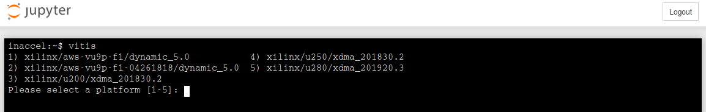

# Vitis_Notebooks

The ability to serve this collection of Jupyter notebooks on demand enhances the usefulness of these notebooks in scientific research and data science. To get started creating your own computing environments, start with [Zero to FPGAs using BinderHub](https://docs.inaccel.com/labs/binderhub-aws).


BinderHub ties together:

* [Kubernetes](https://github.com/kubernetes/kubernetes),
* [JupyterHub](https://github.com/jupyterhub/jupyterhub) &
* [repo2docker](https://github.com/jupyter/repo2docker)

If you wish to test the contents of this repository locally (without BinderHub) follow the steps below:

## Prerequisites

* [Xilinx FPGA Runtime (XRT)](https://github.com/Xilinx/XRT)
* [Docker Community Edition (CE)](https://docs.docker.com/install)
* [InAccel Coral](https://docs.inaccel.com/inaccel/overview)

## Build (optional)

Turn this repository into a Jupyter enabled Docker Image

```sh
pip install jupyter-repo2docker

jupyter-repo2docker \
	--image-name inaccel/jupyter:Vitis_Notebooks \
	--no-run \
	--user-name inaccel \
	https://github.com/inaccel/Vitis_Notebooks
```

## Run

```sh
docker run -it \
	--env CORAL_CLIENT=1 \
	--publish 8888:8888 \
	inaccel/jupyter:Vitis_Notebooks
```

It should output in your terminal something like:

```
To access the notebook, copy and paste this URL in a browser:
	http://localhost:8888/?token=...
```

If you copy paste that URL into your browser you will see a Jupyter Notebook with the contents of this repository!

### `New -> Terminal`

Fetch pre-compiled Vitis Libraries for your FPGA platform


